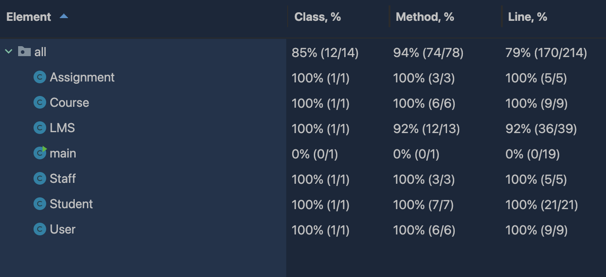

# Automated Code Generation and Unit Testing Assignment 2

#### Case Study Learning Management System

Student 1 name and FAN: Tran Anh Truc Vuong (Hazel Vuong) - vuon0044

Student 2 name and FAN: Pronsuda Ruangsuwan - ruan0031

## 1. List of prompts used to generate the code

1. Initial prompt:
   > Gather all needed requirements for the system so chatGPT can generate the skeleton structure and classes.

"Overall requirements for the Learning management system:
Every student and staff should be able to login LMS.

Students:

- Can access their course materials
- An academic calendar with all the assignment and exam schedules
- Can upload assignments
- Can take part in online exams
- Can check grades through LMS

Academic staff:

- Can upload contents
- Can communicate with students through open student discussion forum

Both:

- Login
- Logout
- Request authentication after any inactivity of ten minutes after opening the LMS page

Write Java code to satisfy above requirements. Details will be given in further prompt. Give detail explanation."

2. Second requirement prompt:
   > From second prompt, we will focus on the functionalities that need to implement in the first generated code. Starting from **Authentication** function for both users.

"Write Java code for a Learning Management System. The system will have 2 main user role which are Student and Academic Staff. Every student and academic staff should be authenticated while entering the LMS. The student and Staff will both have login prompt and depend on their role, they will have different functionality.
We will do unit test case later so make every function public for the sake of testing process."

3. Third requirement prompt:
   > The next function we implemented was **view/access course materials** function for students.

Write Java code for student. After they successfully login using their credential, they will be able to access all their course materials through the learning management system. 4. Fourth requirement prompt:

> The function we implemented was **view academic calendar** function for students.

Write Java code based on previous prompt. An academic calendar will highlight all the assignment and exam schedules 5. Fifth requirement prompt:

> The function we implemented was **upload assignment** function for students.

Write Java code based on previous prompt. Students have the ability to upload assignments on the LMS

6. Sixth requirement prompt:
   > The function we implemented was **take online exam** function for students.

Write Java code based on previous prompt. Students will be able to take part in online exams through LMS 7. Seventh requirement prompt:

> The function we implemented was **check grade** function for students.

Write Java code based on previous prompt. Students will be able to check their grades through LMS

8. Eight requirement prompt:
   > The function we implemented was **upload content** function for academic staff.

Write Java code based on previous prompt. Academics should be able to upload contents. 9. Ninth requirement prompt:

> The function we implemented was **communicate wtih students** function for academic staff.

Write Java code based on previous prompt. Academics can also be able to communicate with students through open student discussion forums

10. Tenth requirement prompt:
    > The function we implemented was **reauthentication** function both users.

Write Java code based on previous prompt. The LMS will request authentication after any inactivity of ten minutes after opening the LMS page

11. Eleventh requirement prompt:
    > The function we implemented was **log out** function both users.

Write Java code based on previous prompt. Users will be able to logout at any time from the LMS page.

12. Final requirement prompt:
    > The Function we implemented was **addUser** and **addCourse** function. 

Write Java code based on previous prompt. Method to add user and course to the LMS system.

## Documentation of unit test cases

Test case notation:

- A: Related test cases in _Assignment_ class
- C: Related test cases in _Course_ class
- L: Related test cases in _LMS_ class
- SF: Related test cases in _Staff_ class
- ST: Related test cases in _Student_ class
- U: Related test cases in _User_ class

#### 1. AssignmentTest

| Test case identifier | Method                        | Description                                                | Expected                                                                                                       | Actual                                                                                | Pass/Fail |
|----------------------|-------------------------------|------------------------------------------------------------|----------------------------------------------------------------------------------------------------------------|---------------------------------------------------------------------------------------|-----------|
| A01                  | getName()                     | Method to retrieve assignment name                         | Equal                                                                                                          | Equal                                                                                 | Pass      |
| A02                  | getDueDate()                  | Method to retrieve due date                                | Equal                                                                                                          | Equal                                                                                 | Pass      |

#### 2. CourseTest
| Test case identifier | Method                        | Description                                                | Expected                                                                                                       | Actual                                                                                | Pass/Fail |
|----------------------|-------------------------------|------------------------------------------------------------|----------------------------------------------------------------------------------------------------------------|---------------------------------------------------------------------------------------|-----------|
| C01                  | getCourseCode()               | Method to get course code                                  | CS103                                                                                                          | CS103                                                                                 | Pass      |
| C02                  | getAssignment()               | 1. Method to retrieve the list of assignments              | 1.1 The assignment list to be initially empty                                                                  | 1.1 The assignment list is empty                                                      | Pass      |
|                      |                               |                                                            | 1.2 After adding 2 assignments, the assignments list should contain 2 elements.                                | 1.2 After adding 2 assignments, the assignments list contains 2 elements              | Pass      |
|                      |                               |                                                            | 1.3 The first element should be assignment1, and the second element should be assignment2.                     | 1.3 The first element is assignment1, and the second element is assignment2           | Pass      |
| C03                  | getExamSchedules()            | 1. Method to get exam schedule                             | 1.1 examSchedule list is not null                                                                              | 1.1 examSchedule list is not null                                                     | Pass      |
|                      |                               |                                                            | 1.2 After adding examDate to the course, the examSchedules list should contain one element.                    | 1.2 After adding examDate to the course, the examSchedules list contains one element. | Pass      |
|                      |                               |                                                            | 1.3 The single element in the examSchedules list should be equal to examDate.                                  | 1.3 The single element in the examSchedules list is equal to examDate.                | Pass      |
| C04                  | addAssignment()               | Method to add multiple assignments to the courses.         | Add assignment to the specific course in the system.                                                           | Assignment is added to the specific course with due date.                             | Pass      |
| C05                  | addExamSchedule()             | 1. Method that allow user to add a scheduled exam on LMS   | 1.1 ExamSchedules list to be initially empty.                                                                  | 1.1 examSchedules list is initially empty                                             | Pass      | 
|                      |                               |                                                            | 1.2 After adding two exam dates (examDate1 and examDate2), the examSchedules list should contain two elements. | 1.2 the examSchedules list contains two elements                                      | Pass      |
|                      |                               |                                                            | 1.3 The first element should be examDate1, and the second element should be examDate2.                         | 1.3 The first element is examDate1, the second element is examDate2                   | Pass      |

#### 3. LMSTest
| Test case identifier | Method                            | Description                                                            | Expected                                                                       | Actual                                                                    | Pass/Fail |
|----------------------|-----------------------------------|------------------------------------------------------------------------|--------------------------------------------------------------------------------|---------------------------------------------------------------------------|-----------|
| L01                  | authenticateSuccess()             | Method to check valid user authentication.                             | Valid user can login with their username and password.                         | User can login with their username and password.                          | Pass      |
| L02                  | authenticateFail                  | Method to check invalid user authentication                            | null                                                                           | null                                                                      | Pass      |
| L03                  | studentAccessCourseMaterial()     | Method that allow student access the course material.                  | Student can access the course material that proof by their last activity time. | Last activity time indicates that student can access the course material. | Pass      |
| L04                  | staffAccessCourseMaterial()       | Method that allow staff access the course material.                    | Equal                                                                          | Equal                                                                     | Pass      |
| L05                  | displayAcademicCalendar()         | Method to generate and display academic calendar                       | Equal                                                                          | Equal                                                                     | Pass      |
| L06                  | studentCheckGrades()              | Method that allow student to check their grades.                       | Student can view their grades on their assignments and enrolled courses.       | Student can view their grades.                                            | Pass      |
| L07                  | academicUploadContent()           | Method for academics to upload content                                 | Equal                                                                          | Equal                                                                     | Pass      |
| L08                  | academicCommunicateWithStudents() | Method that allow staff to communicate with student by posting message | Equal                                                                          | Equal                                                                     | Pass      |
| L09                  | checkUserInactivity()             | Method to check user inactivity more than 10 minutes.                  | User will be asked reconnected to the system.                                  | User is asked to reconnected to the system.                               | Pass      |
| L10                  | checkUserActiveLessThan10Mins()   | Check user active in the timeframe less than 10 minutes.               | User still connecting to the system.                                           | User is not asked to reconnected to the system.                           | Pass      |
| L11                  | logOut()                          | Method that allow user to log out of the system                        | null                                                                           | User@1cab0bfb                                                             | Fail      |

#### 4. StaffTest
| Test case identifier | Method                    | Description                                     | Expected | Actual | Pass/Fail |
|----------------------|---------------------------|-------------------------------------------------|----------|--------|-----------|
| SF01                 | uploadContent()           | Method for staff to upload content on LMS       | Equal    | Equal  | Pass      |
| SF02                 | communicateWithStudents() | Method to communicate with students in a course | Equal    | Equal  | Pass      |
| SF03                 | testUpdateActivityTime()  | Method to update user activity time.            | Equal    | Equal  | Pass      |
         

#### 5. StudentTest
| Test case identifier | Method                               | Description                                                           | Expected                                                                 | Actual                                                   | Pass/Fail |
|----------------------|--------------------------------------|-----------------------------------------------------------------------|--------------------------------------------------------------------------|----------------------------------------------------------|-----------|
| ST01                 | uploadAssignmentEnrolledCourse()     | Method for students to upload assignment for enrolled course          | True                                                                     | True                                                     | Pass      |
| ST02                 | uploadAssignmentToUnenrolledCourse() | Check if the students able to upload assignment for unenrolled course | False                                                                    | False                                                    | Pass      |
| ST03                 | uploadAssignmentPastDueDate()        | Check if students able to upload assignment past due date             | False                                                                    | True                                                     | Fail      |
| ST04                 | takeOnlineExam()                     | Method that allow student take an online exam.                        | Student can take online exam in their enrolled courses.                  | Student allow to take online exam in enrolled courses.   | Pass      |
| ST05                 | takeOnlineExamUnEnrolledCourse()     | Check if students able to take online exam for unenrolled course      | Students cannot take online exam for unenrolled courses.                 | Students cannot take online exam for unenrolled courses. | Pass      |
| ST06                 | takeOnlineExamAfterExamDate()        | Check if students able to take online exam after exam date            | Thrown argument if student attempt to take online exam after exam date.  | 2.2. Nothing was thrown.                                 | Fail      |
| ST07                 | testTakeOnlineExamBeforeExamDate()   | Student can take online exam in the exam date.                        | Thrown argument if student attempt to take online exam before exam date. | 2.1. Nothing was thrown.                                 | Fail      |

#### 6. UserTest
| Test case identifier | Method                | Description                         | Expected | Actual | Pass/Fail |
|----------------------|-----------------------|-------------------------------------|----------|--------|-----------|
| U01                  | getUsername()         | Method to access username           | Equal    | Equal  | Pass      |
| U02                  | getPassword()         | Method to access password           | Equal    | Equal  | Pass      |
| U03                  | getLastActivityTime() | Method to access last activity time | True     | True   | Pass      |

## Coverage of Test cases

## Recommendations

When examining automated code generation technologies, it is remarkable how effectively they can meet human coding demands. We employed ChatGPT 3.5 to generate prompts for creating an LMS system. The generated classes are notably efficient and practically applicable. The quality of the code is measurable through various test cases, with more than half achieving accuracy. Only a few test cases failed.

However, employing this technology requires providing detailed prompts. Unclear instructions deliver less optimal results, as ChatGPT lacks the sophistication to foresee human requirements in certain cases. For instance, in the LMS system, vulnerabilities allow students to upload assignments after the due date. When we simply ordered the AI to generate the method allowing the student to upload their assignment, the generated code permitted uploads for enrolled courses but did not prevent late submissions. This highlights the necessity of detailed specifications to achieve satisfactory results.

Also, using ChatGPT poses data security risks. As an AI trained on extensive data, any information fed into it, such as the details of this study, becomes part of its training set. This information could potentially be accessed by other users, posing a significant risk in business contexts where data confidentiality is important. Leaked business data can lead to severe consequences, including competitive disadvantages, mishandling in commercial contexts, and reputational damage. Additionally, there are concerns regarding plagiarism. The code patterns generated by ChatGPT might originate from various sources, raising issues of originality and intellectual property rights. This could lead to widespread controversies and ethical concerns.

While automated code generation technologies are impressively efficient, caution must be exercised in their use. One must always consider data security, the origins of the generated code, and the rationale for its application.