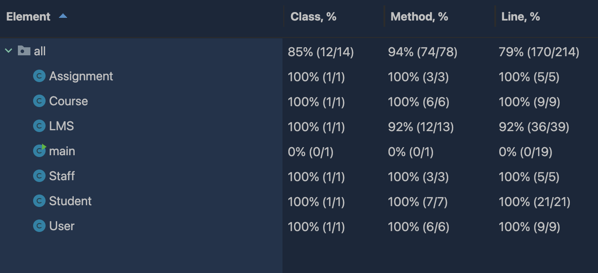

# Automated Code Generation and Unit Testing Assignment 2

#### Case Study Learning Management System

Student 1 name and FAN: Tran Anh Truc Vuong (Hazel Vuong) - vuon0044

Student 2 name and FAN: Pronsuda Ruangsuwan - ruan0031

## 1. List of prompts used to generate the code

1. Initial prompt:
   > Gather all needed requirements for the system so chatGPT can generate the skeleton structure and classes.

"Overall requirements for the Learning management system:
Every student and staff should be able to login LMS.

Students:

- Can access their course materials
- An academic calendar with all the assignment and exam schedules
- Can upload assignments
- Can take part in online exams
- Can check grades through LMS

Academic staff:

- Can upload contents
- Can communicate with students through open student discussion forum

Both:

- Login
- Logout
- Request authentication after any inactivity of ten minutes after opening the LMS page

Write Java code to satisfy above requirements. Details will be given in further prompt. Give detail explanation."

2. Second requirement prompt:
   > From second prompt, we will focus on the functionalities that need to implement in the first generated code. Starting from **Authentication** function for both users.

"Write Java code for a Learning Management System. The system will have 2 main user role which are Student and Academic Staff. Every student and academic staff should be authenticated while entering the LMS. The student and Staff will both have login prompt and depend on their role, they will have different functionality.
We will do unit test case later so make every function public for the sake of testing process."

3. Third requirement prompt:
   > The next function we implemented was **view/access course materials** function for students.

Write Java code for student. After they successfully login using their credential, they will be able to access all their course materials through the learning management system. 4. Fourth requirement prompt:

> The function we implemented was **view academic calendar** function for students.

Write Java code based on previous prompt. An academic calendar will highlight all the assignment and exam schedules 5. Fifth requirement prompt:

> The function we implemented was **upload assignment** function for students.

Write Java code based on previous prompt. Students have the ability to upload assignments on the LMS

6. Sixth requirement prompt:
   > The function we implemented was **take online exam** function for students.

Write Java code based on previous prompt. Students will be able to take part in online exams through LMS 7. Seventh requirement prompt:

> The function we implemented was **check grade** function for students.

Write Java code based on previous prompt. Students will be able to check their grades through LMS

8. Eight requirement prompt:
   > The function we implemented was **upload content** function for academic staff.

Write Java code based on previous prompt. Academics should be able to upload contents. 9. Ninth requirement prompt:

> The function we implemented was **communicate wtih students** function for academic staff.

Write Java code based on previous prompt. Academics can also be able to communicate with students through open student discussion forums

10. Tenth requirement prompt:
    > The function we implemented was **reauthentication** function both users.

Write Java code based on previous prompt. The LMS will request authentication after any inactivity of ten minutes after opening the LMS page

11. Eleventh requirement prompt:
    > The function we implemented was **log out** function both users.

Write Java code based on previous prompt. Users will be able to logout at any time from the LMS page.

12. Final requirement prompt:
    > The Function we implemented was **addUser** and **addCourse** function. 

Write Java code based on previous prompt. Method to add user and course to the LMS system.

## Documentation of unit test cases

Test case notation:

- A: Related test cases in _Assignment_ class
- C: Related test cases in _Course_ class
- L: Related test cases in _LMS_ class
- SF: Related test cases in _Staff_ class
- ST: Related test cases in _Student_ class
- U: Related test cases in _User_ class

#### 1. AssignmentTest

| Test case identifier | Method                        | Description                                                | Expected                                                                                                       | Actual                                                                                | Pass/Fail |
|----------------------|-------------------------------|------------------------------------------------------------|----------------------------------------------------------------------------------------------------------------|---------------------------------------------------------------------------------------|-----------|
| A01                  | getName()                     | Method to retrieve assignment name                         | Equal                                                                                                          | Equal                                                                                 | Pass      |
| A02                  | getDueDate()                  | Method to retrieve due date                                | Equal                                                                                                          | Equal                                                                                 | Pass      |

#### 2. CourseTest
| Test case identifier | Method                        | Description                                                | Expected                                                                                                       | Actual                                                                                | Pass/Fail |
|----------------------|-------------------------------|------------------------------------------------------------|----------------------------------------------------------------------------------------------------------------|---------------------------------------------------------------------------------------|-----------|
| C01                  | getCourseCode()               | Method to get course code                                  | CS103                                                                                                          | CS103                                                                                 | Pass      |
| C02                  | getAssignment()               | 1. Method to retrieve the list of assignments              | 1.1 The assignment list to be initially empty                                                                  | 1.1 The assignment list is empty                                                      | Pass      |
|                      |                               |                                                            | 1.2 After adding 2 assignments, the assignments list should contain 2 elements.                                | 1.2 After adding 2 assignments, the assignments list contains 2 elements              | Pass      |
|                      |                               |                                                            | 1.3 The first element should be assignment1, and the second element should be assignment2.                     | 1.3 The first element is assignment1, and the second element is assignment2           | Pass      |
| C03                  | getExamSchedules()            | 1. Method to get exam schedule                             | 1.1 examSchedule list is not null                                                                              | 1.1 examSchedule list is not null                                                     | Pass      |
|                      |                               |                                                            | 1.2 After adding examDate to the course, the examSchedules list should contain one element.                    | 1.2 After adding examDate to the course, the examSchedules list contains one element. | Pass      |
|                      |                               |                                                            | 1.3 The single element in the examSchedules list should be equal to examDate.                                  | 1.3 The single element in the examSchedules list is equal to examDate.                | Pass      |
| C04                  | addAssignment()               | Method to add multiple assignments to the courses.         | Add assignment to the specific course in the system.                                                           | Assignment is added to the specific course with due date.                             | Pass      |
| C05                  | addExamSchedule()             | 1. Method that allow user to add a scheduled exam on LMS   | 1.1 ExamSchedules list to be initially empty.                                                                  | 1.1 examSchedules list is initially empty                                             | Pass      | 
|                      |                               |                                                            | 1.2 After adding two exam dates (examDate1 and examDate2), the examSchedules list should contain two elements. | 1.2 the examSchedules list contains two elements                                      | Pass      |
|                      |                               |                                                            | 1.3 The first element should be examDate1, and the second element should be examDate2.                         | 1.3 The first element is examDate1, the second element is examDate2                   | Pass      |

#### 3. LMSTest
| Test case identifier | Method                            | Description                                                            | Expected                                                                       | Actual                                                                    | Pass/Fail  |
|----------------------|-----------------------------------|------------------------------------------------------------------------|--------------------------------------------------------------------------------|---------------------------------------------------------------------------|------------|
| L01                  | authenticateSuccess()             | Method to check valid user authentication.                             | Valid user can login with their username and password.                         | User can login with their username and password.                          | Pass       |
| L02                  | authenticateFail                  | Method to check invalid user authentication                            | null                                                                           | null                                                                      | Pass       |
| L03                  | studentAccessCourseMaterial()     | Method that allow student access the course material.                  | Student can access the course material that proof by their last activity time. | Last activity time indicates that student can access the course material. | Pass       |
| L04                  | staffAccessCourseMaterial()       | Method that allow staff access the course material.                    | Equal                                                                          | Equal                                                                     | Pass       |
| L05                  | displayAcademicCalendar()         | Method to generate and display academic calendar                       | Equal                                                                          | Equal                                                                     | Pass       |
| L06                  | studentCheckGrades()              | Method that allow student to check their grades.                       | Student can view their grades on their assignments and enrolled courses.       | Student can view their grades.                                            | Pass       |
| L07                  | academicUploadContent()           | Method for academics to upload content                                 | Equal                                                                          | Equal                                                                     | Pass       |
| L08                  | academicCommunicateWithStudents() | Method that allow staff to communicate with student by posting message | Equal                                                                          | Equal                                                                     | Pass       |
| L09                  | checkUserInactivity()             | Method to check user inactivity more than 10 minutes.                  | User will be asked reconnected to the system.                                  | User is asked to reconnected to the system.                               | Pass       |
| L10                  | checkUserActiveLessThan10Mins()   | Check user active in the timeframe less than 10 minutes.               | User still connecting to the system.                                           | User is not asked to reconnected to the system.                           | Pass       |
| <mark>L11            | <mark>logOut()                    | <mark>Method that allow user to log out of the system                  | <mark>null                                                                     | <mark>User@1cab0bfb                                                       | <mark>Fail |

#### 4. StaffTest
| Test case identifier | Method                    | Description                                     | Expected | Actual | Pass/Fail |
|----------------------|---------------------------|-------------------------------------------------|----------|--------|-----------|
| SF01                 | uploadContent()           | Method for staff to upload content on LMS       | Equal    | Equal  | Pass      |
| SF02                 | communicateWithStudents() | Method to communicate with students in a course | Equal    | Equal  | Pass      |
| SF03                 | testUpdateActivityTime()  | Method to update user activity time.            | Equal    | Equal  | Pass      |
         

#### 5. StudentTest
| Test case identifier | Method                                   | Description                                                           | Expected                                                                       | Actual                                                   | Pass/Fail  |
|----------------------|------------------------------------------|-----------------------------------------------------------------------|--------------------------------------------------------------------------------|----------------------------------------------------------|------------|
| ST01                 | uploadAssignmentEnrolledCourse()         | Method for students to upload assignment for enrolled course          | True                                                                           | True                                                     | Pass       |
| ST02                 | uploadAssignmentToUnenrolledCourse()     | Check if the students able to upload assignment for unenrolled course | False                                                                          | False                                                    | Pass       |
| <mark>ST03           | <mark>uploadAssignmentPastDueDate()      | <mark>Check if students able to upload assignment past due date       | <mark>False                                                                    | <mark>True                                               | <mark>Fail |
| ST04                 | takeOnlineExam()                         | Method that allow student take an online exam.                        | Student can take online exam in their enrolled courses.                        | Student allow to take online exam in enrolled courses.   | Pass       |
| ST05                 | takeOnlineExamUnEnrolledCourse()         | Check if students able to take online exam for unenrolled course      | Students cannot take online exam for unenrolled courses.                       | Students cannot take online exam for unenrolled courses. | Pass       |
| <mark>ST06           | <mark>takeOnlineExamAfterExamDate()      | <mark>Check if students able to take online exam after exam date      | <mark>Thrown argument if student attempt to take online exam after exam date.  | <mark>Nothing was thrown.                                | <mark>Fail |
| <mark>ST07           | <mark>testTakeOnlineExamBeforeExamDate() | <mark>Student can take online exam in the exam date.                  | <mark>Thrown argument if student attempt to take online exam before exam date. | <mark>Nothing was thrown.                                | <mark>Fail |

#### 6. UserTest
| Test case identifier | Method                | Description                         | Expected | Actual | Pass/Fail |
|----------------------|-----------------------|-------------------------------------|----------|--------|-----------|
| U01                  | getUsername()         | Method to access username           | Equal    | Equal  | Pass      |
| U02                  | getPassword()         | Method to access password           | Equal    | Equal  | Pass      |
| U03                  | getLastActivityTime() | Method to access last activity time | True     | True   | Pass      |

After conducting all the test cases, we collected 4 tests failed in total. The logout method in LMS class and User class, uploadAssignment() that pass due date, and takeOnlineExam() that before and after the exam date. 

## Coverage of Test cases

#### LMS class
We did not cover line 69 to 71 in LMS class for studentTakeOnlineExam() method as we already test the takeOnlineExam() method in student class. We think it might overlap with the test cases in StudentTest file. As a result, we left it as 92%. 

## Recommendations

In this study of automated code generation technologies, observing how they can remarkably meet human coding requirements is incredible. We utilized ChatGPT 3.5 to generate various prompts to create a Learning Management System (LMS). Each class generated is highly efficient and practical for real-world applications. The capability of the generated code can be estimated through various test cases, with over half demonstrating accuracy. Only a few test cases failed. However, implementing this technology requires providing detailed and specific prompts, as generalized instructions deliver less satisfactory results. It has been noted that ChatGPT is not sufficiently intelligent to think on behalf of humans in specific scenarios.

There are some problems we were facing while generating the code in chatGPT through given prompts. Firstly, we tried to give instructions for each functionality in each prompt, however, the results will be inconsistent and illogical compared to the previous prompt results. Then, we changed our strategy to give an overall picture of the system and then break down to smaller functionalities. This strategy was better as we required chatGPT to modify the code itself based on the first prompt, yet experienced insufficient reasoning. 

For example, in the LMS system, some vulnerabilities prevent students from uploading assignments. We tested the generated code by simply instructing the system to enable assignment uploads in the enrolled courses. However, the generated code did not prevent students from uploading assignments after the due date. This indicates that to achieve satisfactory results, prompts must be intensely detailed, which makes bug tracking in the system a challenging task. Additionally, inputting various data into ChatGPT poses data security risks. As ChatGPT is an AI trained with an extensive amount of information, the data from this study becomes another example stored by ChatGPT, potentially reused with other users.

Therefore, using this technology in a business context might risk data leaks, causing significant damage regarding sensitive business information, competition, commercial usage, and even the organization’s image. The code patterns generated by ChatGPT may originate from various sources, leading to potential plagiarism issues, which can lead to extensive debates. While this technology serves as an efficient tool, it is also a double-edged sword, prompting humans to remain awake as the technology becomes increasingly sophisticated. The role of programming might decrease, pushing humans to develop themselves to stay ahead of technology constantly.

While automated code generation technologies are impressively efficient in assisting humans, caution must be exercised in their use. Data security, the origin of the generated code, and the reasons for its usage must always be considered, ensuring alignment with regulations and ethics.